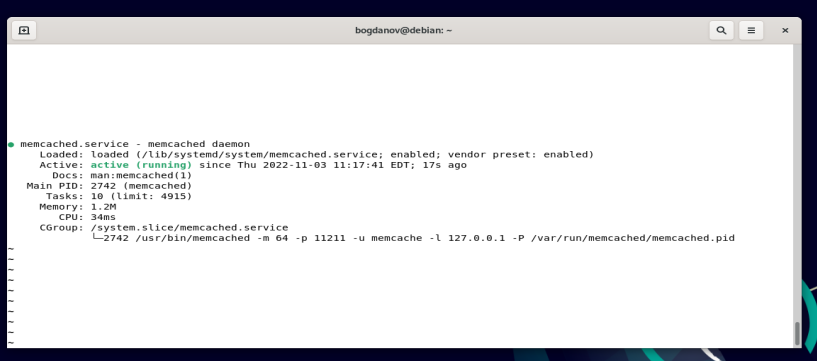
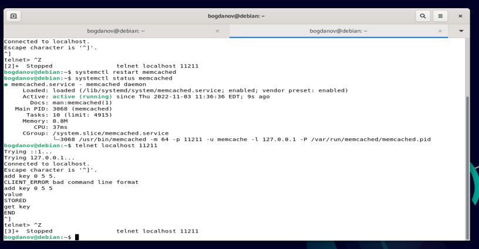
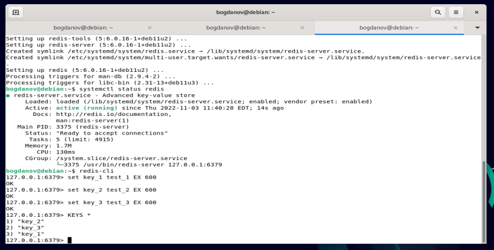

# Домашнее задание к занятию 11.2 "Кеширование Redis/memcached"

Домашнее задание выполните в Google Docs и отправьте в личном кабинете на проверку ссылку на ваш документ.

Название файла должно содержать номер лекции и фамилию студента. Пример названия: "11.2 Кеширование Redis/memcached - Александр Александров"

Перед тем как выслать ссылку, убедитесь, что ее содержимое не является приватным (открыто на просмотр всем, у кого есть ссылка). Если необходимо прикрепить дополнительные ссылки, просто добавьте их в свой Google Docs.

Любые вопросы по решению задач задавайте в чате учебной группы.

---

### Задание 1. Кэширование. 

Приведите примеры проблем, которые может решить кэширование. 

*Приведите ответ в свободной форме.*

снизить нагрузку на БД - меньше запросов к БД на получение даннх
снизить нагрузку на сетевую инфраструктуру - меньше трафика по сети, если данные уже есть "рядом" в буфере
повысить отзывчивость приложения - быстрый ответ на запрос, т.к. не нужно выполнять запросы или расчеты
увеличить количество обрабатываемых запросов к приложению - больше пользователей в момент времени

---

### Задание 2. Memcached.

Установите и запустите memcached.

*Приведите скриншот systemctl status memcached, где будет видно, что memcached запущен.*

---

### Задание 3. Удаление по TTL в Memcached.

Запишите в memcached несколько ключей с любыми именами и значениями, для которых выставлен TTL 5. 

*Приведите скриншот, на котором видно, что спустя 5 секунд ключи удалились из базы.*

---

### Задание 4. Запись данных в Redis. 

Запишите в redis несколько ключей с любыми именами и значениями. 

*Через redis-cli достаньте все записанные ключи и значения из базы, приведите скриншот этой операции.*

---

## Дополнительные задания (со звездочкой*)
Эти задания дополнительные (не обязательные к выполнению) и никак не повлияют на получение вами зачета по этому домашнему заданию. Вы можете их выполнить, если хотите глубже и/или шире разобраться в материале.

### Задание 5*. Работа с числами. 

Запишите в redis ключ key5 со значением типа "int" равным числу 5. Увеличьте его на 5, чтобы в итоге в значении лежало число 10.  

*Приведите скриншот, где будут проделаны все операции и будет видно, что значение key5 стало равно 10.*