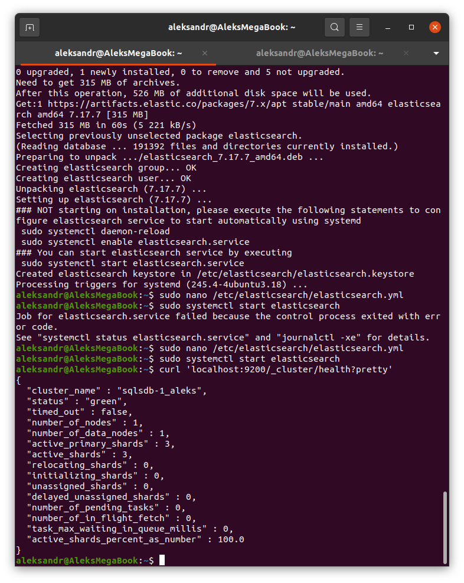
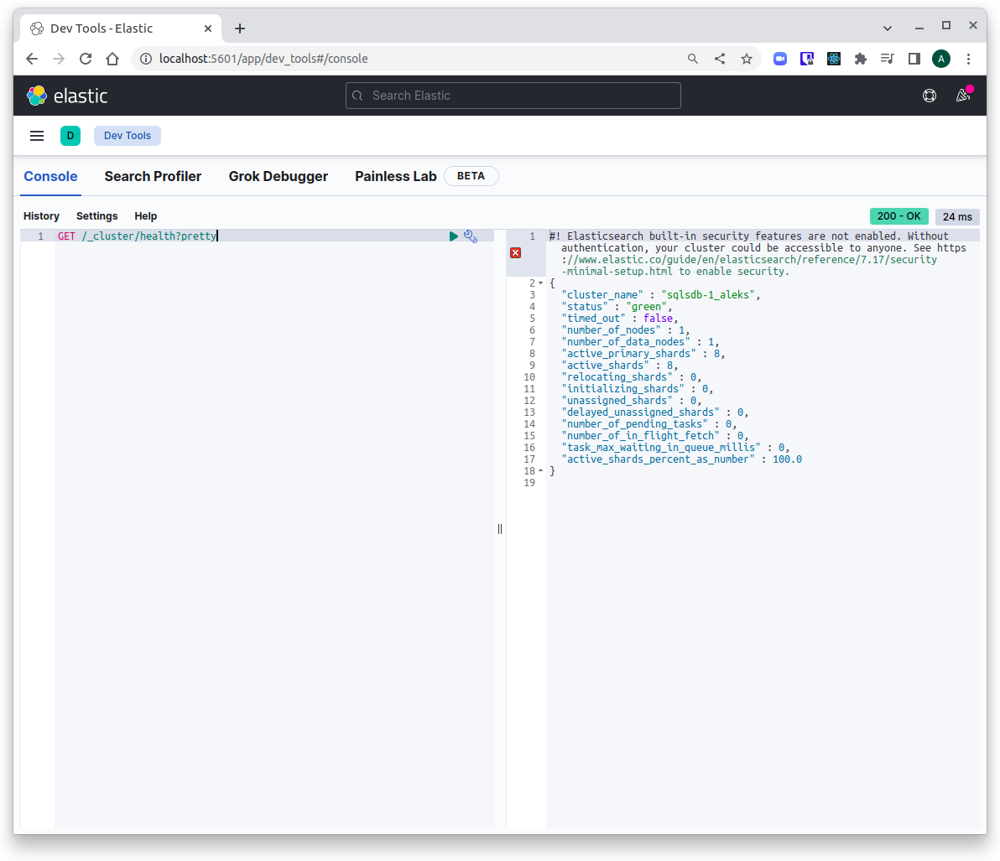
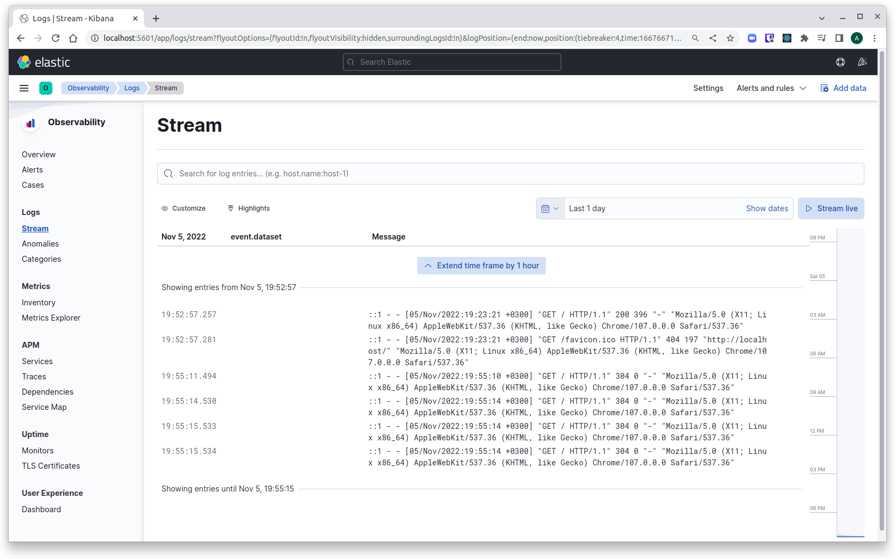
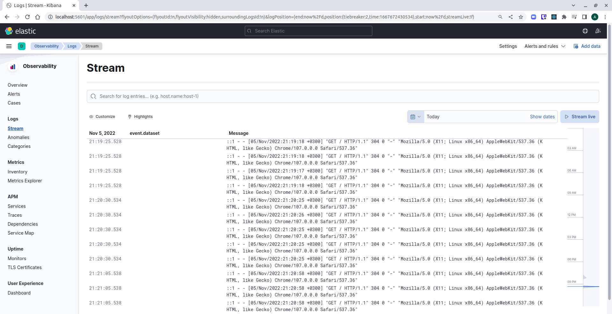

# Домашнее задание к занятию 11.3 "ELK"

Домашнее задание выполните в Google Docs и отправьте в личном кабинете на проверку ссылку на ваш документ.

Название файла должно содержать номер лекции и фамилию студента. Пример названия: "11.3 ELK - Александр Александров"

Перед тем как выслать ссылку, убедитесь, что ее содержимое не является приватным (открыто на просмотр всем, у кого есть ссылка). Если необходимо прикрепить дополнительные ссылки, просто добавьте их в свой Google Docs.

Любые вопросы по решению задач задавайте в чате учебной группы.

---

### Задание 1. Elasticsearch. 

Установите и запустите elasticsearch, после чего поменяйте параметр cluster_name на случайный. 

*Приведите скриншот команды 'curl -X GET 'localhost:9200/_cluster/health?pretty', сделанной на сервере с установленным elasticsearch. Где будет виден нестандартный cluster_name*

---

### Задание 2. Kibana.

Установите и запустите kibana.

*Приведите скриншот интерфейса kibana на странице http://<ip вашего сервера>:5601/app/dev_tools#/console, где будет выполнен запрос GET /_cluster/health?pretty*

---

### Задание 3. Logstash.

Установить и запустить Logstash и Nginx. С помощью Logstash отправить access-лог nginx в Elasticsearch. 

*Приведите скриншот интерфейса kibana, на котором видны логи nginx.*

---

### Задание 4. Filebeat. 

Установить и запустить Filebeat. Переключить поставку логов Nginx с Logstash на Filebeat. 

*Приведите скриншот интерфейса kibana, на котором видны логи nginx, которые были отправлены через Filebeat.*

## Дополнительные задания (со звездочкой*)
Эти задания дополнительные (не обязательные к выполнению) и никак не повлияют на получение вами зачета по этому домашнему заданию. Вы можете их выполнить, если хотите глубже и/или шире разобраться в материале.

### Задание 5*. Доставка данных. 

Настройте поставку лога в Elasticsearch через Logstash и Filebeat любого другого сервиса(не nginx). 
Для этого лог должен писаться на файловую систему, Logstash должен корректно его распарсить и разложить на поля. 

*Приведите скриншот интерфейса kibana, на котором будет виден этот лог и напишите лог какого приложения отправляется.*
